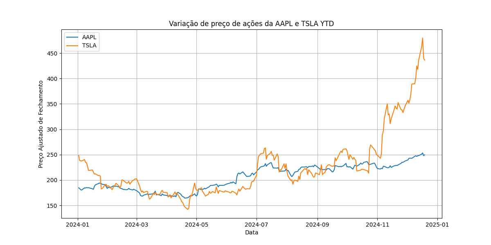

# llm-agents

AutoGen framework example. This framework enables development of LLM applications using multiple agents that can converse with each other to solve tasks.

In this example, it is created two types of agents:
1. **AssistantAgent**: A helper agent that generates Python code based on instructions.
2. **UserProxyAgent**: A proxy that simulates the user’s interaction.

## Setup

To run this project, follow these steps:

In the root of the project, create a `.env` file and add your **API key**:

```env
API_KEY=your-api-key-here
```

Run the script:
```bash
python your_script.py
```

## Example

Input prompt: "Plot a chart of AAPL and TESLA stock price change YTD. Save the python code. Save the result to a file named chart.png."

1. **UserProxyAgent** sends the input prompt to **AssistantAgent**.

2. **AssistantAgent** generates the Python code to plot the chart and save the result as `chart.png`.

3. **UserProxyAgent** runs the generated code.

4. If the code runs successfully:
    - The chart is saved as `chart.png` in the `coding_folder`.

5. If an error occurs:
    - **UserProxyAgent** captures the error and sends it back to **AssistantAgent** for debugging and correction.
    - **AssistantAgent** analyzes the error, corrects the code (e.g., fixing dependencies, adjusting syntax), and sends the corrected version to the **UserProxyAgent**.

6. **UserProxyAgent** re-runs the corrected code.

7. The final output (`chart.png`) is saved in the `coding_folder`.


